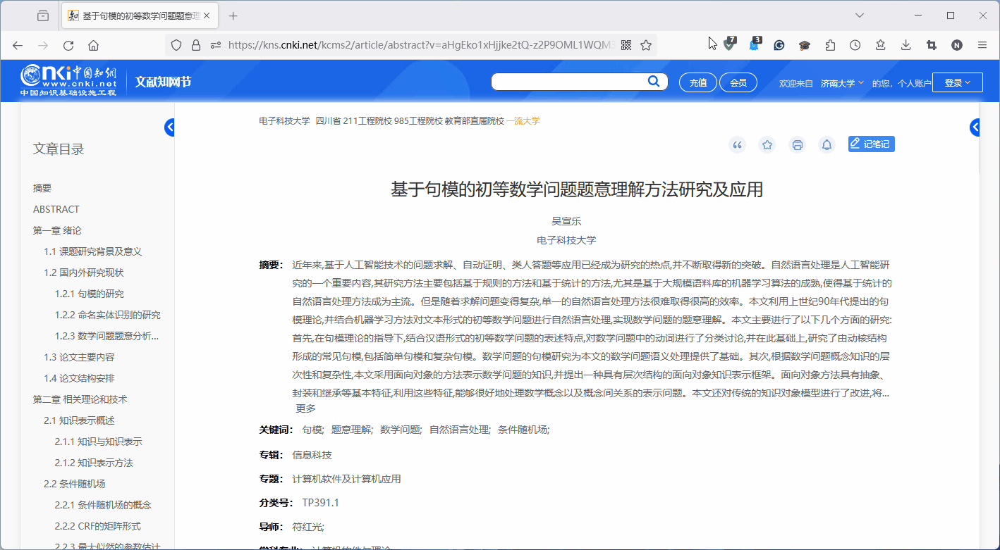

<!--
 * @Author: nicholas9698 nicholas9698@outlook.com
 * @Date: 2024-03-18 14:14:17
 * @LastEditors: nicholas9698 nicholas9698@outlook.com
 * @LastEditTime: 2024-03-18 17:27:58
 * @FilePath: \PL-UJN\文献管理和论文引用\README.md
 * @Description: 这是默认设置,请设置`customMade`, 打开koroFileHeader查看配置 进行设置: https://github.com/OBKoro1/koro1FileHeader/wiki/%E9%85%8D%E7%BD%AE
-->
# Zotero管理文献及创建参考文献表

安装 Zotero 后，通常会自动安装 word 相关加载项，但可能需要手动搜索安装 Zotero 的浏览器插件。

添加文献时，点击浏览器插件即可：

## 添加知网等中文文献 ##

推荐使用  来抓取中文文献、网页等资料。其主要功能如下：

1. 中文期刊附件（PDF/CAJ）的元数据抓取，支持添加PDF/CAJ时自动抓取元数据功能
2. 集成 Zotero 中文社区转换器的下载与更新功能
3. 为知网学位论文PDF添加章节书签（依赖于PDFtk）
4. 更新中文文献引用次数，核心期刊信息
5. 合并/拆分姓，名，识别文献条目语言，下载知网附件，统一日期格式等

### 安装茉莉花组件 ###

从 [jasminum release](https://github.com/l0o0/jasminum/releases) 版本页下载对应版本 xpi 组件（FireFox 需要右键 `从连接另存文件为` 下载）。

通过 `Zotero-->工具-->设置按钮-->Install Add_on From File...` 安装 xpi 组件

## 在Word中生成参考文献列表

对于安装 UJN 参考文献的引用格式，请参照该 [说明文件](https://github.com/nicholas9698/PL-UJN/tree/main/%E6%96%87%E7%8C%AE%E7%AE%A1%E7%90%86%E5%92%8C%E8%AE%BA%E6%96%87%E5%BC%95%E7%94%A8/zotero%E5%BC%95%E7%94%A8%E6%A0%B7%E5%BC%8F) 。

### 1. 添加文献引用和构建文献列表

在 word 文档，输入相关内容，通过 `工具栏-->Zotero-->Add/Edit Citation` 为内容添加参考文献。通过 `工具栏-->Zotero-->Add/Edit Bibliography` 创建参考文献列表。

> ***个人感觉经典视图比搜索模式更高效，推荐启用经典视图***
>
> `Zotero-->编辑-->引用-->文档编辑软件-->使用经典版“添加引注”对话框`
>
> 

### 2. 标号交叉引用 ###

在添加完所有引用后，可以通过 word 宏 的方式为所有标号创建交叉引用（添加/修改 文档中的引用后会失效，需要重新操作）。

对于设置 word 宏 的相关内容，请参照该 [说明文件](https://github.com/nicholas9698/PL-UJN/tree/main/%E6%96%87%E7%8C%AE%E7%AE%A1%E7%90%86%E5%92%8C%E8%AE%BA%E6%96%87%E5%BC%95%E7%94%A8/word%E5%AE%8F)

设置 word 宏 后，通过 `工具栏-->视图-->宏-->查看宏-->ZoteroLinkCitation-->运行` 以设置文档内容的交叉引用。

## 其他功能推荐 ##

***1.划词翻译***

推荐使用  ，其主要功能包括：

1. 划词翻译
2. 翻译引擎与字典引擎
3. 拼接文本并翻译
4. 翻译结果加入笔记
5. 独立翻译窗口与多引擎结果对比
6. ......

与安装茉莉花组件类似，其 xpi 组件可以从 [zotero-pdf-translate release](https://github.com/windingwind/zotero-pdf-translate/releases) 版本页面下载。

