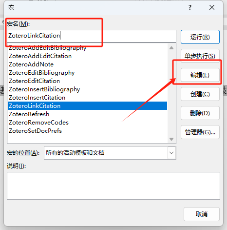
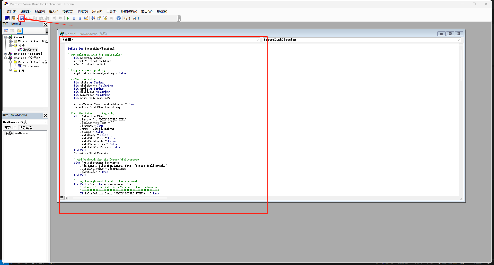

# Zotero实现Word交叉引用

Zotero 官方并未提供 Word 交叉引用的功能，现有的实现方法主要来自第三方作者。

本项目中使用的是 Zotero 论坛中 [antikorpo](https://forums.zotero.org/discussion/comment/148343/#Comment_148343) 提供的方法，通过设置 Word 宏 实现交叉引用。

宏的具体内容包含在 `./ZoteroLinkCitation` 中。

## 宏设置 ##

通过 `Word 工具栏-->视图-->宏-->查看宏` 打开宏窗口，输入 ZoteroLinkCitation 点击编辑，编写宏文件。

将本目录下 `./ZoteroLinkCitation` 文件中的内容复制到窗口中，并点击保存。

