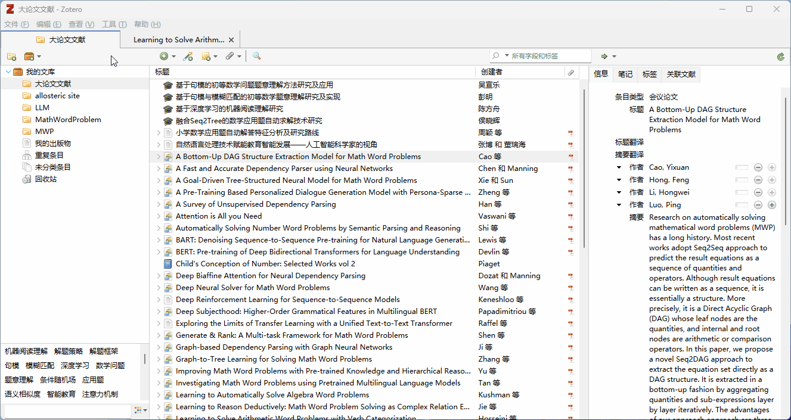
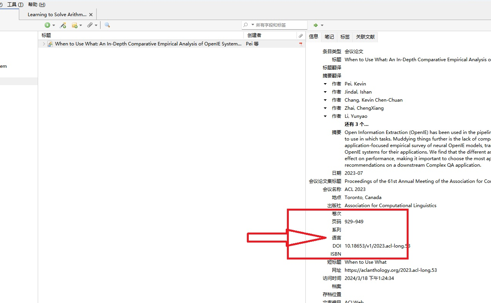
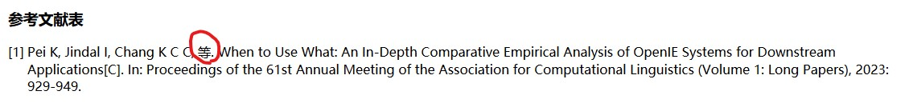
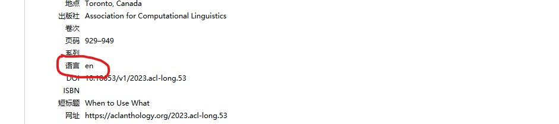
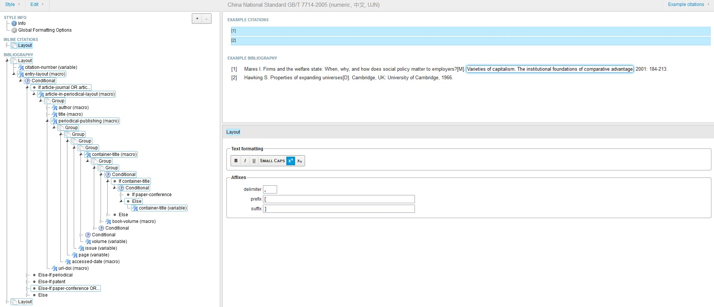

# Chinese-gb7714-2005-numeric-UJN #

 

本CSL样式是基于 [Chinese-STD-GB-T-7714-related-csl](https://github.com/redleafnew/Chinese-STD-GB-T-7714-related-csl) 中 [017gb-t-7714-2005-numeric-bilingual.csl](https://github.com/redleafnew/Chinese-STD-GB-T-7714-related-csl/blob/main/017gb-t-7714-2005-numeric-bilingual.csl) 修改得到。

引用导出样式如下：

## 使用方法 ##

`Zotero-->编辑-->首选项-->引用-->样式`

## 使用注意 ##

对于英文文献添加至 Zotero 后，需要检查文献信息中是否包含 “语言” 信息，若缺失可以手动添加 “en”，否则会出现英文文献作者中出现 “等” 而不是 “et.al”。

### 1. 未添加语言信息的英文文献 ###
   
   

   

### 2. 添加语言信息后 ###
    
   

   

## CSL格式文件自定义修改 ##

如果需要对引用格式进一步修改，可以使用相关 [可视化工具](https://editor.citationstyles.org/visualEditor/) 进行修改。

