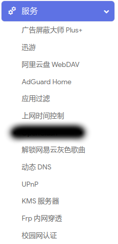
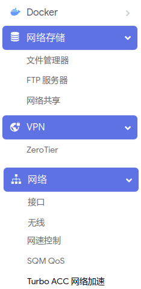
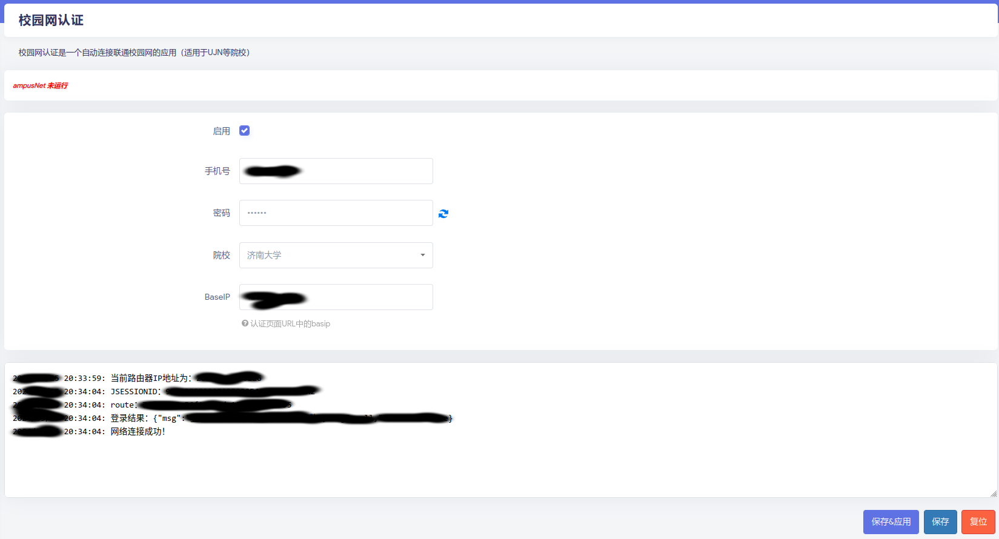

# 网络相关内容

## 1. 实验室网络环境

实验室网络虽然能够直接访问 [Github](https://github.com) 等资源，但是 [ACL Anthology](https://aclanthology.org/) 等会议集、期刊等网站访问经常出问题，同时像[https://raw.githubusercontent.com](raw.githubusercontent.com)、[docker.io](https://docker.io)、[ghcr.io](https://ghcr.io)等资源下载也很慢。

这里推荐使用低功耗的x86架构PC，安装 OpenWrt 等路由器系统，并选用相关插件来提升访问效率。下面放一个自用的 OpenWrt 版本（因为我需求变化不多，可能不怎么更新）：

> 百度网盘链接：[openwrt-x86-64-20240327-efi.img](https://pan.baidu.com/s/18crIklZBqruszpdYZwPDow?pwd=v5an ) 提取码: v5an

### 主要包含功能插件

- 磁盘管理
- Docker
- 文件管理器 & smba文件共享
- Frpc & ZeroTier 内网穿透
- 网速控制 & Qos & Turbo ACC网络加速(SFE与流量统计冲突)
- 广告屏蔽大师 & AdGuard Home
- 应用过滤 & 上网控制
- 网易云灰色歌曲解锁
- 微软 KMS 激活验证服务
- 校园网认证 & 网络环境加速

安装方法：推荐使用 [IMG写盘工具](https://roadkil.net/program.php/P12/Disk%20Image)，直接将镜像写入磁盘

 

## 2. 宿舍网络环境

接入运营商的宿舍，通常需要使用相应软件来拨号上网，并且限制两台设备。日常使用PC、笔记本、手机、Pad经常不够用，并且XBOX、PS、Switch等无法验证上网。由于平常主要使用 🇨🇳🎀，因此在 OpenWrt 上实现了一下自动上网认证，进而实现多设备的联网支持。

联网插件已经集成在了第一节的镜像中，单独下载安装插件请见该项目 

